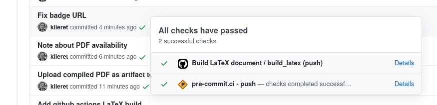

# Proceeding for CHEP23

This repository holds the LaTeX source of the proceeding for the [CHEP23 conference][chep23]

## Previewing the PDF

Since the latest commits you can also retrieve the compiled PDF for each commit:

1. Click on the checkmark/cross next to a commit
2. Click on `Details` next to `Build LaTeX document / build_latex`
3. Click on `Summary` in the left side bar
4. Scroll down to the artifacts

[chep23]: https://www.jlab.org/conference/CHEP2023
